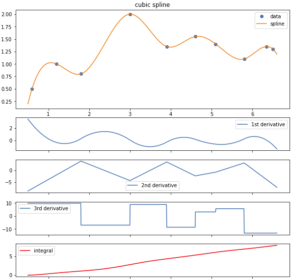

## C++ templated cubic spline implementation

Simple header-only C++ library that implements a pretty fast cubic spline interpolant. 

Possible boundary conditions:
- **clamped**
    - parametrization of first derivative
- **natural** (default)
    - parametrization of second derivative
- **not-a-knot**

Methods for obtaining derivatives of the curve and its integration are also available.



### Usage

Include header file and use.

```C++
#include <vector>
#include "spline.hpp"
...
    std::vector<double> x, y;
    ...
    Spline<double> s(x,y); // spline with zero 2nd derivative both left abd right (natural)
    double value = s(1.0);
```
...or
```C++
    Spline<double> s;
    s.fit(x,y);
    double value = s(1.0);
```

If one type of boundary conditions is specified in the constructor, it is applied to the left and right boundaries with the value `0.0`:
```C++
    Spline<double> s(x,y, Spline<double>::bc_type::clamped);        // zero left and right 1st derivative 
    Spline<double> s(x,y, Spline<double>::bc_type::natural, 1.0);   // 1.0 left and right 2nd derivative 
```
In case of not-a-knot boundary condition, if any value is specified, it will be ignored.
```C++
    Spline<double> s(x,y, Spline<double>::bc_type::notaknot, 3.14); // left and right not-a-knot spline segments
```

There are some other variants of instantiation (see [examples](./examples)).

### Details

If you instantiated spline object without data you cant use it to evaluate spline until you fit it to data with `fit` method.

The boundary conditions cannot be changed for the instantiated spline object. You can only fit it to new data.
If you need to change the boundary conditions, you need to create a new spline.